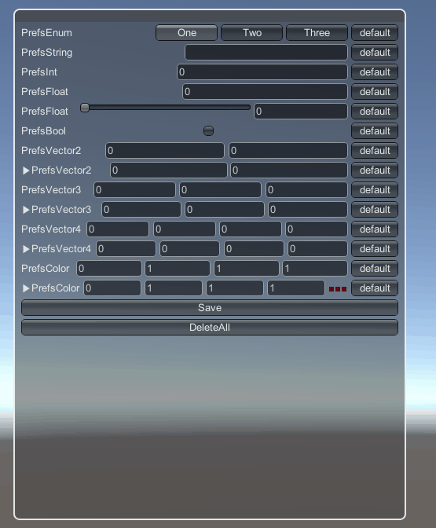
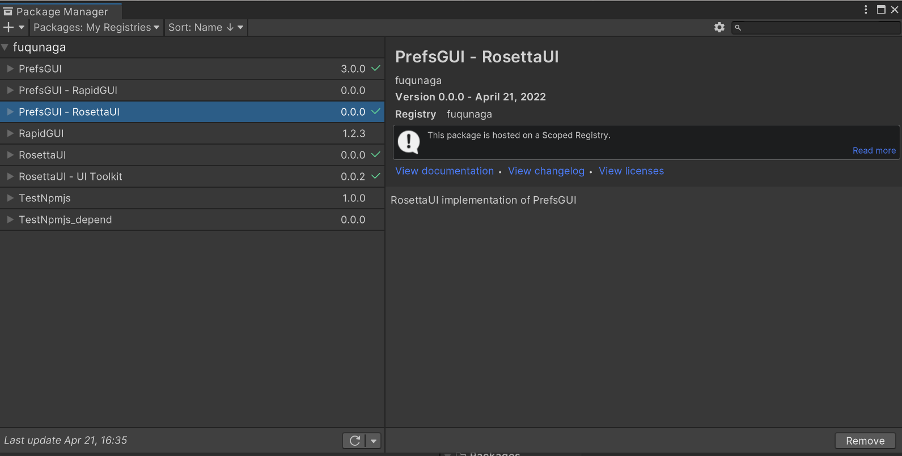

# PrefsGUI
Accessors and GUIs for persistent preference values using a JSON file



```csharp
// define PrefsParams with key.
public PrefsBool              prefsBool    = new("PrefsBool");
public PrefsInt               prefsInt     = new("PrefsInt");
public PrefsFloat             prefsFloat   = new("PrefsFloat");
public PrefsString            prefsString  = new("PrefsString");
public PrefsParam<EnumSample> prefsEnum    = new("PrefsEnum");
public PrefsColor             prefsColor   = new("PrefsColor");
public PrefsVector2           prefsVector2 = new("PrefsVector2");
public PrefsVector3           prefsVector3 = new("PrefsVector3");
public PrefsVector4           prefsVector4 = new("PrefsVector4");
public PrefsAny<CustomClass>  prefsClass   = new("PrefsClass");
public PrefsList<CustomClass> prefsList    = new("PrefsList");


public Element CreateElement(LabelElement label)
{
    return UI.Column(
        prefsBool.CreateElement(),
        prefsInt.CreateElement(),
        prefsFloat.CreateElement(),
        prefsFloat.CreateSlider(),
        prefsString.CreateElement(),
        prefsEnum.CreateElement(),
        prefsColor.CreateElement(),
        prefsVector2.CreateElement(),
        prefsVector2.CreateSlider(),
        prefsVector3.CreateElement(),
        prefsVector3.CreateSlider(),
        prefsVector4.CreateElement(),
        prefsVector4.CreateSlider(),
        prefsClass.CreateElement(),
        prefsList.CreateElement()
    );
}
```

## Installation

This package uses the [scoped registry] feature to resolve package dependencies. 

[scoped registry]: https://docs.unity3d.com/Manual/upm-scoped.html


**Edit > ProjectSettings... > Package Manager > Scoped Registries**

Enter the following and click the Save button.

```
"name": "fuqunaga",
"url": "https://registry.npmjs.com",
"scopes": [ "ga.fuquna" ]
```


**Window > Package Manager**

Select `MyRegistries` in `Packages:`


Install `PrefsGUI - RosettaUI` and `RosettaUI - UIToolkit`  
If you prefer IMGUI, select the `PrefsGUI - RapidGUI` instead.



If you do not see it, make sure that your Unity version is 2021.3 or higher.


## PrefsSearch

Display loaded PrefsParams with a partial key match.


## EditorWindow

**Window -> PrefsGUI**


- Display all loaded PrefsParams that can be modified.
- Feed back the current value as a default value.
- Edit the key prefix for each GameObject.

### JSON file path
```
Application.persistentDataPath + "/Prefs.json"
```

You can customize it by placing `PrefsWrapperPathCustom` in the scene and setting the `Path` field.
Special folder names and environment variables are also available.

```
- %dataPath% -> Application.dataPath
- %companyName% -> Application.companyName
- %productName% -> Application.productName
- other %[word]% -> System.Environment.GetEnvironmentVariable([word])
```


## PrefsMaterialProperty

Auto-create material menu.


## Sync PrefsParams over a network

see [PrefsGUISyncForMirror](https://github.com/fuqunaga/PrefsGUISyncForMirror)


## References

- [RosettaUI](https://github.com/fuqunaga/RosettaUI)
- [RapidGUI](https://github.com/fuqunaga/RapidGUI)
- [PrefsGUISyncForMirror](https://github.com/fuqunaga/PrefsGUISyncForMirror)
